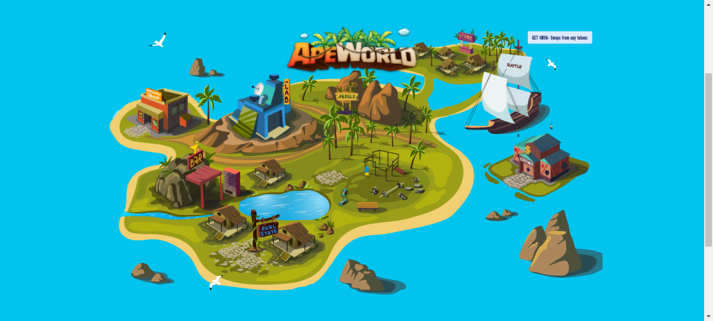
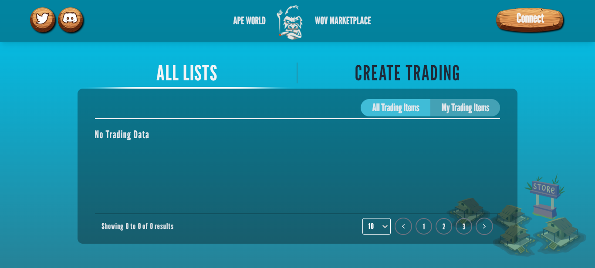
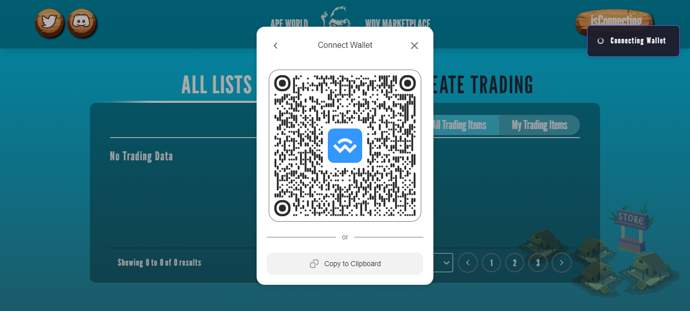
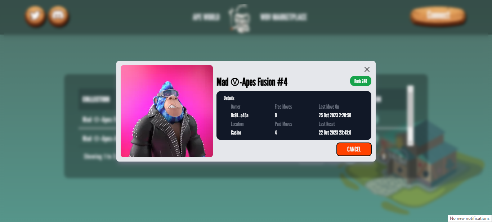

# ape-world-wov-marketplace

Web3 World of Apes Runs WOV Marketplace - built with React

## Getting Started

```bash
# install dependencies
npm install
# or
yarn install

# serve with hot reload at localhost:3000
npm start
# or
yarn start
```

## Visit Marketplace App

[Visit **APEWORLD** Marketplace](https://example.com/)

http://localhost:3000/

## Screenshots









&copy; 2022 - 2024 @devmaster518

All Rights Reserved.
